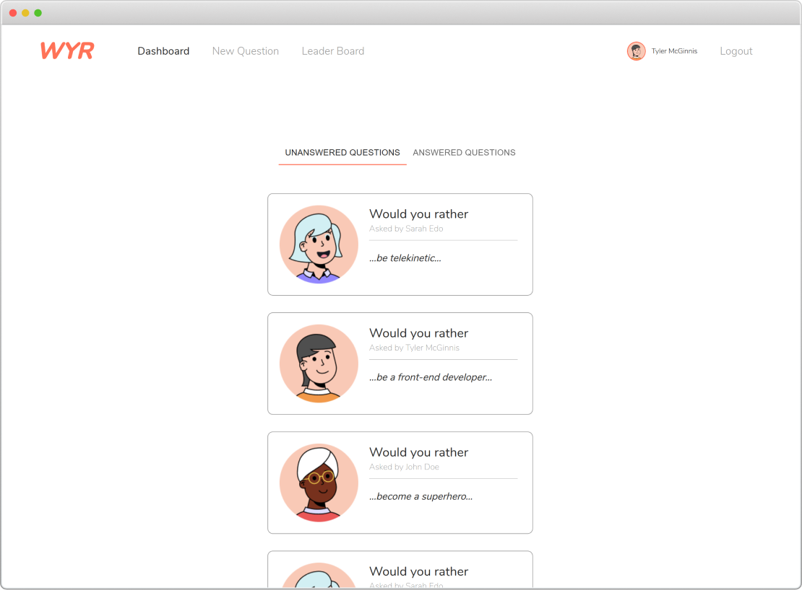
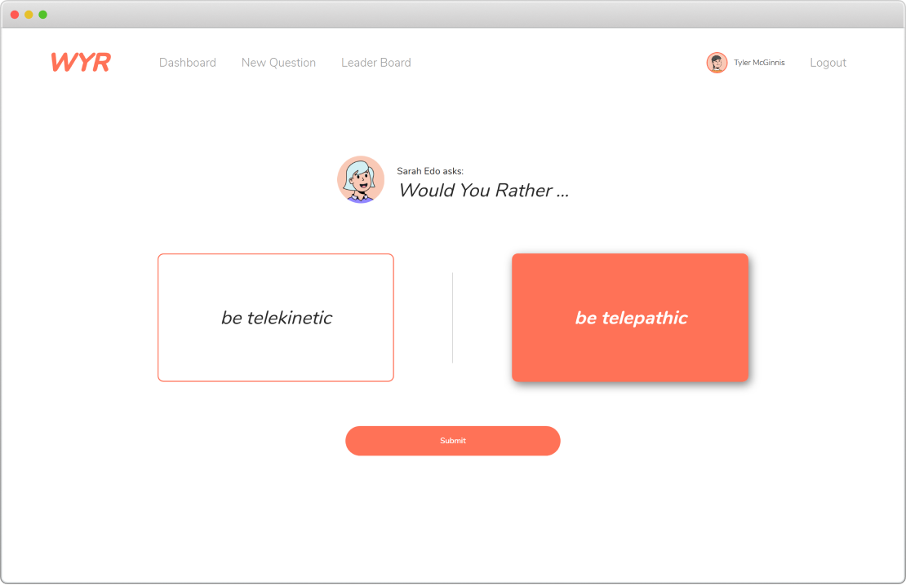
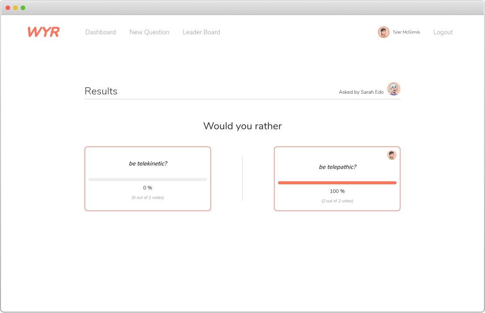
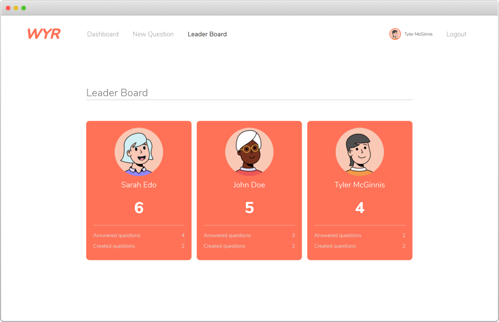

# Would you rather...?

"Would you rather" is a game app created with React and Redux.
 
 

## Overview

The app lets users play the “Would You Rather?” game. 
A user can ask or answer a question in the form: “Would you rather [option A] or [option B] ?”  
After answering a question, the user can see the poll result of the question.
 
 

#### Screenshots

01 - Dashboard
 
 

02 - Question Page
 
 

03 - Question Page
 
 

04 - Leader Board
 
 

## Setup

To run this project:

- install all project dependencies with `yarn install`
- start the development server with `yarn start`
